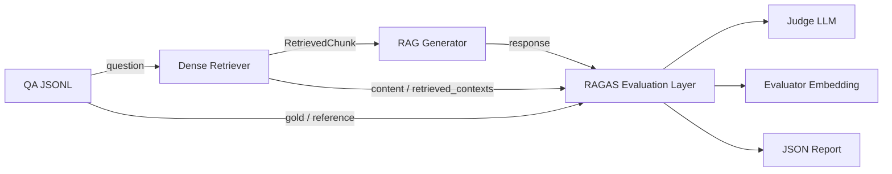

# RAGAS 整体评测

## 1. RAGAS 在本项目中的位置

RAGAS 是一个面向 RAG 和其他 LLM 应用的评测框架。可以把当前系统想成一名“开卷答题者”：Retriever 负责从资料柜里取页，Generator 负责看资料作答，RAGAS 则是独立阅卷层。它不参与检索和回答，只读取一次已经发生的 RAG 运行结果并打分。



RAGAS 与原有 Retrieval Eval 同时保留：

- `agenticrag-eval-retrieval` 检查 Retriever 是否找回人工标注的 chunk ID，使用 Recall@K 和 MRR。
- `agenticrag-eval-ragas` 运行完整的 Retrieval → Generation 链路，再从语义、事实和上下文质量等角度评分。

评测逻辑位于 `src/eval/ragas/`，没有写入 Retriever 或 Generator。`RagAnswerService` 只增加了向后兼容的 `answer_with_trace()`：原有 `answer()` 返回值不变，新方法额外暴露本次检索到的 chunks。

## 2. 为什么使用 RAGAS 0.4.3 的新 API

本项目固定使用 RAGAS `0.4.3`。RAGAS 0.4 已从旧的 `evaluate(dataset, metrics=...)` 转向 collections metrics；新指标从 `ragas.metrics.collections` 导入，直接调用：

```python
result = await metric.ascore(
    user_input=question,
    response=answer,
    retrieved_contexts=contexts,
)
score = result.value
```

因此本项目没有使用旧的 `evaluate()`、`SingleTurnSample.single_turn_ascore()`、`LangchainLLMWrapper` 或 `LangchainEmbeddingsWrapper`。每个指标单独调用还能做到局部容错：一个指标失败时，其余分数仍被保留。

RAGAS 0.4.3 当前仍会导入一个已从 `langchain-community` 0.4 删除的 VertexAI 兼容模块，因此 `evaluation` extra 暂时固定 `langchain-community==0.3.31`。升级 RAGAS 时应首先重新验证并尝试移除此固定版本。

官方资料：

- [RAGAS 0.3 → 0.4 迁移指南](https://docs.ragas.io/en/stable/howtos/migrations/migrate_from_v03_to_v04/)
- [RAGAS Metrics 总览](https://docs.ragas.io/en/stable/concepts/metrics/overview/)

## 3. 四个核心字段从哪里来

一次评测样本的映射如下：

| RAGAS 字段 | 本项目来源 | 是否真实运行产生 |
| --- | --- | --- |
| `user_input` | `qa.jsonl` 的 `question` | 数据集原始字段 |
| `reference` | `qa.jsonl` 的 `gold` | 数据集原始字段，经确定性文本化 |
| `retrieved_contexts` | 当前 Retriever 返回的每个 `RetrievedChunk.content` | 是 |
| `response` | 当前 RAG Generator 返回的 `GeneratedAnswer.answer` | 是 |

`gold` 在现有数据里有字符串、列表和数值三种形式。适配规则不调用 LLM：

- 字符串去掉首尾空白；
- 单元素列表取其中的文本；
- 多元素列表按多条参考答案写成项目列表；
- 整数和浮点数转成稳定的 JSON 数字文本；
- 字典按 key 排序后转成 JSON 文本。

关键转换只有这一行：

```python
retrieved_contexts = [chunk.content for chunk in trace.retrieved_chunks]
```

这保证 RAGAS 看到的就是 Retriever 实际返回并传给 Generator 的正文，顺序也与 Milvus Top-K 排名一致。报告同时保存 `retrieved_chunk_ids` 和 `retrieved_contexts`，方便回查来源。Generator 最终只引用了哪些 chunk，不会改变这里的输入；RAGAS 检查的是整组 Top-K 上下文。

## 4. 六个指标分别测什么

所有分数原则上位于 0 到 1，越高越好。它们回答的问题不同，不能只看一个总分。

| 指标 | 输入 | 依赖 | 它回答的问题 |
| --- | --- | --- | --- |
| Faithfulness | `user_input`、`response`、`retrieved_contexts` | Judge LLM | 回答中的事实陈述能否由检索正文支持？ |
| Answer Relevancy | `user_input`、`response` | Judge LLM + Embedding | 回答是否直面问题、完整且少跑题？ |
| Answer Correctness | `user_input`、`response`、`reference` | Judge LLM + Embedding | 回答与标准答案在事实及语义上是否一致？ |
| Context Recall | `user_input`、`reference`、`retrieved_contexts` | Judge LLM | 标准答案里的信息有多少能归因到检索正文？ |
| Context Precision | `user_input`、`reference`、`retrieved_contexts` | Judge LLM | 排名前面的 chunks 是否真正有助于得到标准答案？ |
| Context Entity Recall | `reference`、`retrieved_contexts` | Judge LLM | 标准答案中的实体有多少也出现在检索正文中？ |

### Faithfulness

Faithfulness 先把生成回答拆成可核验陈述，再判断每条陈述是否能从上下文推出。它检查“有没有脱离资料说话”，并不检查资料本身是否正确，也不直接比较标准答案。

例子：检索正文只说 A 业务收入为 100 万元，回答却说 A 业务收入为 100 万元且同比增长 30%。即使句子回答了问题，后半句没有证据，Faithfulness 会下降。

[官方 Faithfulness 说明](https://docs.ragas.io/en/stable/concepts/metrics/available_metrics/faithfulness/)

### Answer Relevancy

RAGAS 0.4.3 中类名仍是 `AnswerRelevancy`，文档页面称 Response Relevancy。本项目报告使用官方类的指标名 `answer_relevancy`。它会让 Judge 从回答反推若干问题，再用 evaluator embedding 比较这些问题与原问题的相似度，同时识别回避式回答。

它不判断事实正确。例如原问题问收入，回答直接给出一个错误收入，相关性可能仍然很高，Answer Correctness 才负责识别错误。

[官方 Response Relevancy 说明](https://docs.ragas.io/en/stable/concepts/metrics/available_metrics/answer_relevance/)

### Answer Correctness

Answer Correctness 比较 `response` 与 `reference`，默认由两部分组成：

- Judge LLM 做陈述级事实匹配；
- evaluator embedding 做语义相似度比较。

RAGAS 0.4.3 默认权重是事实性 0.75、语义相似度 0.25。它衡量“最终答案对不对”，但分数仍受 gold 质量、答案表达形式以及 Judge 判断影响。

[官方 Answer Correctness 说明](https://docs.ragas.io/en/stable/concepts/metrics/available_metrics/answer_correctness/)

### Context Recall

Context Recall 以标准答案为信息清单，判断其中多少陈述可以由检索上下文支持。它主要定位漏检：若标准答案含四个业务板块，Top-K 只覆盖两个，分数通常会下降。

[官方 Context Recall 说明](https://docs.ragas.io/en/stable/concepts/metrics/available_metrics/context_recall/)

### Context Precision

本项目使用有 reference 的 `ContextPrecisionWithReference`。Judge 逐个判断 Top-K chunk 是否有助于回答问题，再按排名计算平均精度。相关 chunk 排在越前面越好；无关 chunk 混入较多或相关 chunk 靠后都会影响分数。

[官方 Context Precision 说明](https://docs.ragas.io/en/stable/concepts/metrics/available_metrics/context_precision/)

### Context Entity Recall

这个指标先从 reference 与全部 retrieved contexts 中提取实体，再计算 reference 实体的覆盖比例。当前金融 QA 经常含公司、年份、金额和业务名称，适合作为补充诊断，因此第一版启用。

它不适合单独评价检索质量：`600,000万元`、`60亿元` 和 `600000 万元` 在语义上可能相同，但实体抽取或字符串规范化可能把它们当成不同实体；推理型问题也可能几乎没有稳定实体。应把它与 Context Recall、原文和 Judge 输出一起看。

[官方 Context Entities Recall 说明](https://docs.ragas.io/en/stable/concepts/metrics/available_metrics/context_entities_recall/)

## 5. Recall@K 与 RAGAS Context Recall 的区别

它们名字都含 Recall，但评分依据不同。

| 比较项 | Retrieval Eval Recall@K | RAGAS Context Recall |
| --- | --- | --- |
| Gold | 人工标注的 `relevant_chunk_ids` | 自然语言 `reference` |
| 判断方式 | chunk ID 精确匹配 | Judge LLM 做语义归因 |
| 是否依赖 LLM | 否 | 是 |
| 是否可完全复现 | 是 | 不一定 |
| 主要用途 | 验证指定证据块是否被找回 | 验证标准答案所需信息是否被上下文覆盖 |

一个 chunk 与人工标注的 gold chunk 不同，但同样包含答案时，Recall@K 会判为未命中，Context Recall 可能判为覆盖。反过来，标注 chunk 被找回但解析文本缺失关键表格内容时，Recall@K 可以为 1，Context Recall 仍可能很低。两套评测应共同保留。

## 6. Evaluator 配置

Judge 配置使用独立的 `RagasEvaluatorConfig` 和 `RAGAS_EVALUATOR_*` 环境变量。被测生成模型继续使用 `GenerationConfig` 和 `GENERATION_*`。修改 Judge 不会改变系统实际回答，修改生成模型也不会暗中切换 Judge。`RAGAS_EVALUATOR_MODEL` 和 `RAGAS_EVALUATOR_BASE_URL` 必须在 `.env` 中显式配置，程序不会从生成模型配置或代码默认值中静默继承。

```env
# 密钥只写入本机 .env，不提交到仓库
RAGAS_EVALUATOR_API_KEY=your-api-key
RAGAS_EVALUATOR_BASE_URL=https://dashscope.aliyuncs.com/compatible-mode/v1
RAGAS_EVALUATOR_MODEL=qwen-plus
RAGAS_EVALUATOR_TEMPERATURE=0
RAGAS_EVALUATOR_MAX_TOKENS=4096
RAGAS_EVALUATOR_TIMEOUT=120
RAGAS_EVALUATOR_MAX_RETRIES=2
RAGAS_EVALUATOR_ENABLE_THINKING=false
```

若没有单独设置 `RAGAS_EVALUATOR_API_KEY`，配置会复用 `DASHSCOPE_API_KEY`，但 model、base URL、temperature、timeout 等仍由 evaluator 自己的配置控制。报告不会写入任何 API Key，只记录是否已配置。

Answer Relevancy 和 Answer Correctness 使用独立的 evaluator embedding 配置，默认沿用项目的本地 Qwen3-Embedding-0.6B 参数：

```env
RAGAS_EVALUATOR_EMBEDDING_MODEL=Qwen/Qwen3-Embedding-0.6B
RAGAS_EVALUATOR_EMBEDDING_DEVICE=cpu
RAGAS_EVALUATOR_EMBEDDING_BATCH_SIZE=32
RAGAS_EVALUATOR_EMBEDDING_NORMALIZE=true
RAGAS_EVALUATOR_EMBEDDING_QUERY_PROMPT_NAME=query
```

RAGAS Judge 通过 `openai.AsyncOpenAI` 连接 DashScope 的 OpenAI-compatible endpoint，再交给 RAGAS 0.4 的 `llm_factory()`。Evaluator embedding 直接使用 RAGAS 0.4 的现代 `HuggingFaceEmbeddings` provider，没有使用已弃用的 LangChain wrapper。

## 7. 确定性数值正确性

除 RAGAS 的 `answer_correctness` 外，报告还包含 `numeric_correctness`。它只适用于数值型 QA：从 reference 和生成答案中提取数值，去掉千分位分隔符，统一金额单位，并根据 reference 的小数位数使用半个最小显示单位作为 tolerance。百分比与纯小数表示也支持等价比较，例如 `0.6116` 与 `61.16%`。

生成答案可能同时包含最终结果和中间计算值，因此指标要求每个 reference 数值都能在生成答案中找到一个不同的匹配值；额外的解释性数值不会单独导致失败。非数值型 QA 的该指标为 `null`，不参与 aggregate average。它是 RAGAS `answer_correctness` 的补充，不替代 LLM Judge。

若 Generator 与 Judge 使用同一模型，可能出现风格偏好和共同盲点：Judge 更容易认可与自己表达方式相似的答案。正式对比实验应固定同一个 Judge，并抽样做人审；条件允许时再用不同模型复评争议样本。当前 smoke 中被测生成模型为 `glm-5.2`，Judge 为 `qwen-plus`，二者不同。

## 8. 新增模块职责

| 文件 | 职责 |
| --- | --- |
| `src/eval/ragas/dataset.py` | 读取 QA JSONL；将 question/gold 转成 question/reference |
| `src/eval/ragas/config.py` | 读取并校验独立 Judge 与 evaluator embedding 配置 |
| `src/eval/ragas/providers.py` | 创建 RAGAS LLM、embedding 和六个 collections metrics |
| `src/eval/ragas/evaluator.py` | 调用每个 `metric.ascore()`；隔离单指标错误 |
| `src/eval/ragas/report.py` | 报告数据结构、聚合和原子 JSON 写入 |
| `src/eval/ragas/runner.py` | 组织 QA → RAG → RAGAS → Report，提供 CLI |
| `src/eval/numeric_correctness.py` | 提取、标准化并确定性比较数值答案 |
| `src/agenticrag/rag/service.py` | 新增 `answer_with_trace()`，暴露答案和真实 chunks |

同一条样本的六项指标彼此独立，因此并发执行；不同 QA 仍按顺序处理，避免突然放大生成模型、Judge API 和本地 embedding 的负载。

## 9. 安装和运行

安装完整评测需要的四组可选依赖：

```bash
uv sync \
  --extra evaluation \
  --extra generation \
  --extra embeddings \
  --extra milvus
```

先确认 Milvus Compose 已启动且 `.env` 中的 `MILVUS_COLLECTION` 指向已经入库的 collection。

### Smoke test

```bash
uv run \
  --extra evaluation \
  --extra generation \
  --extra embeddings \
  --extra milvus \
  agenticrag-eval-ragas \
  --dataset qa.jsonl \
  --top-k 5 \
  --limit 1 \
  --output artifacts/eval/ragas_smoke_report.json
```

### 完整评测

```bash
uv run \
  --extra evaluation \
  --extra generation \
  --extra embeddings \
  --extra milvus \
  agenticrag-eval-ragas \
  --dataset qa.jsonl \
  --top-k 5 \
  --output artifacts/eval/ragas_report.json
```

CLI 参数：

- `--dataset`：包含 `question + gold` 的 JSONL，默认 `qa.jsonl`；
- `--top-k` / `--k`：Retriever 返回的上下文数量，默认 5；
- `--limit`：只运行前 N 条；
- `--output`：JSON 报告路径；
- `--uri`、`--collection-name`：临时覆盖 Milvus 配置。

## 10. 如何阅读报告

顶层关键字段：

- `dataset_size`、`top_k`：本次实际评测规模和检索数量；
- `generation_model`：被测生成模型；
- `embedding_model`：Retriever 使用的 embedding；
- `evaluator_model`、`evaluator_embedding_model`：阅卷模型；
- `ragas_version`：实际运行的 RAGAS 版本；
- `aggregate_metrics`：每项成功分数的平均值；
- `aggregate_metric_counts`：每项平均值实际用了多少条；
- `successful_samples`、`failed_samples`：完全成功和含错误的样本数。

每条 `samples[]` 保存 question、reference、generated answer、chunk IDs、完整 contexts、六项分数和 `evaluation_error`。如果某个指标失败，它的分数为 `null`，错误记录在同名 key；汇总只平均有限的成功分数。阅读平均分时必须一起看 `aggregate_metric_counts`。

Smoke test 的实际结果（1 条、Top-5、RAGAS 0.4.3）：

| 指标 | 分数 |
| --- | ---: |
| Faithfulness | 0.5000 |
| Answer Relevancy | 0.9871 |
| Answer Correctness | 0.6897 |
| Context Recall | 1.0000 |
| Context Precision | 0.7500 |
| Context Entity Recall | 0.0000 |

这条样本 Context Recall 为 1 而 Entity Recall 为 0，说明语义归因认为关键信息已覆盖，但实体抽取后的集合没有匹配。应先查看 reference 与五段 context 中金额、年份和公司名的写法，再判断是规范化问题、中文实体抽取问题还是实际漏检。

完整评测的实际结果（19 条、Top-5、被测模型 `glm-5.2`、Judge `qwen-plus`）已冻结为 `Naive RAG V0 Baseline`。本次使用 `RAGAS_EVALUATOR_MAX_TOKENS=4096`，19 条样本全部完成，`failed_samples=0`：

| 指标 | 平均分 | 有效样本数 |
| --- | ---: | ---: |
| Faithfulness | 0.6259 | 19 |
| Answer Relevancy | 0.5813 | 19 |
| Answer Correctness | 0.5806 | 19 |
| Context Recall | 0.6842 | 19 |
| Context Precision | 0.6181 | 19 |
| Context Entity Recall | 0.1904 | 19 |
| Numeric Correctness | 0.5714 | 14 |

其中 `numeric_correctness` 只对 14 条数值型 QA 生效，另外 5 条叙述型 QA 记录为 `null`，不参与平均。后续 V1、V2 应固定这份报告及其配置，与该 baseline 对比；若 Judge 模型或答案长度发生变化，应重新检查是否仍有 `IncompleteOutputException`。

## 11. 低分时先查哪里

| 低分组合 | 优先排查 | 常见原因 |
| --- | --- | --- |
| Context Recall 低 | Retriever / PDF 解析 / chunking | 关键页未召回、表格解析丢失、chunk 切断答案、Top-K 太小 |
| Context Precision 低而 Recall 高 | Retriever 排序 | 无关块过多、关键块排名靠后、Dense 语义过宽 |
| Entity Recall 低而 Context Recall 高 | 实体抽取与格式，再看 Retriever | 单位换算、数字格式、别名、中文实体边界 |
| Faithfulness 低而 Context 指标高 | Generator | 模型添加资料外事实、概括过度、提示词约束不足 |
| Answer Relevancy 低 | Generator / 问题格式 | 回答跑题、回避、遗漏问题中的多个子要求 |
| Answer Correctness 低且 Context Recall 低 | 先查 Retriever | Generator 没拿到足够证据 |
| Answer Correctness 低但 Recall、Faithfulness 高 | gold、Generator 推理与格式 | 证据足够且回答有依据，但计算错、选错结论或 gold 表达不一致 |

排查一条样本时，先读 `question → reference → retrieved_chunk_ids/contexts → generated_answer`，最后看指标。分数是定位线索，不是事实裁决。

## 12. 当前限制与后续实验

1. RAGAS 指标大量依赖 Judge LLM。temperature 为 0 只能降低波动，不能保证不同时间、模型版本和供应商实现完全一致。
2. 六项指标会产生多次 Judge 请求，完整评测有明显时间和 API 成本。先用 `--limit` 验证配置，再跑全量。
3. evaluator embedding 与 Retriever embedding 在同一进程中分别加载，以满足 RAGAS 0.4 的现代 provider 接口；CPU 模式启动较慢且会占用额外内存。
4. QA 中包含数值计算、隐式推理和规划型问题。自然语言 gold 不一定完整列出全部中间证据，Context Recall 可能低估或高估真实检索质量。
5. 当前 PDF 文本来自第一版解析链路。表格结构、跨页内容和扫描件质量都会传递到 RAGAS 分数。
6. 当前所有 Top-K contexts 都交给评测，包括 Generator 没有显式引用的 chunk。这样评价的是整条检索链路，而不是引用选择器。
7. Context Entity Recall 对中文别名、数字格式和单位换算敏感，只作为补充指标。

后续比较 Dense、Reranker 和 Hybrid 时，应固定：

- 同一份 QA 和 reference；
- 同一个 Generator、Judge 和 evaluator embedding；
- 同一 Top-K，或把 Top-K 作为明确实验变量；
- 相同 RAGAS 版本和指标配置。

每个方案单独输出报告，例如 `ragas_dense_k5.json`、`ragas_reranker_k5.json`、`ragas_hybrid_k5.json`。同时保留 Retrieval Eval 的 Recall@K/MRR，便能区分“找回了人工 gold chunk”“语义证据覆盖更好”“回答更正确”三种不同提升。
